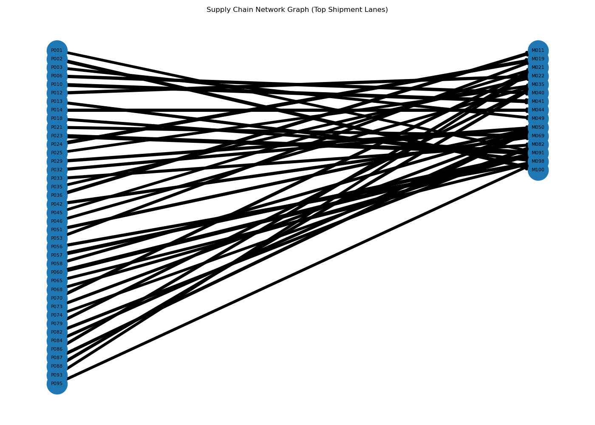
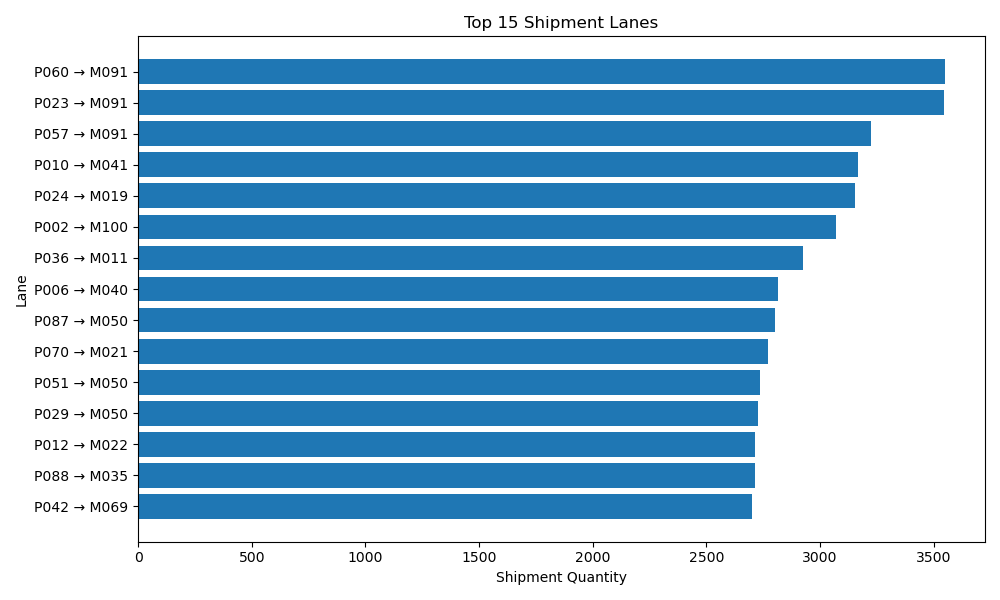
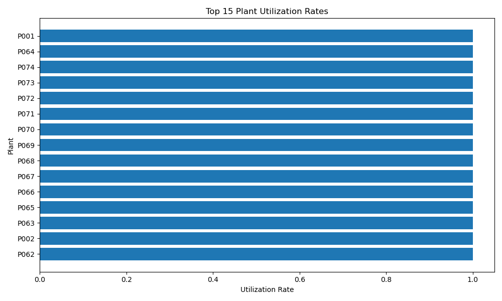
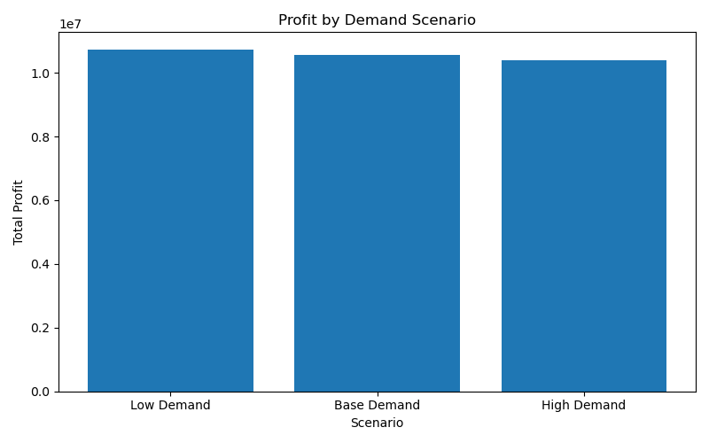

# Supply Chain Optimization Project

This project builds a supply chain optimization model using linear programming to determine the most profitable shipment plan across a network of plants and markets.

## Project Overview

This project demonstrates how optimization and analytics can support supply chain decision-making.

Workflow includes:

- Data preprocessing
- Linear programming optimization
- Scenario simulation
- Visualization
- Interactive dashboard

## Visualization

### Supply Chain Network Graph

### Top Shipment Lanes

### Plant Utilization

### Scenario Profit Comparison

## Run the Project

python src/preprocess.py  
python src/optimization_model.py  
python src/scenario_simulation.py  
python src/visualize_results.py  
python src/network_graph.py  

Launch dashboard:

streamlit run dashboard/app.py
