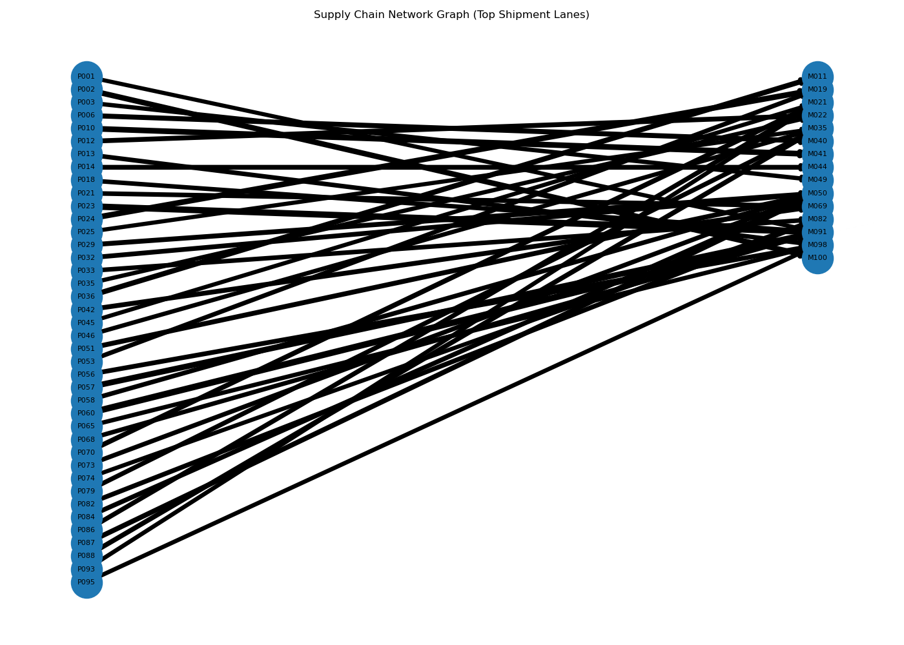
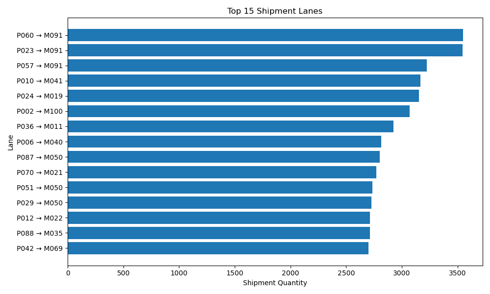
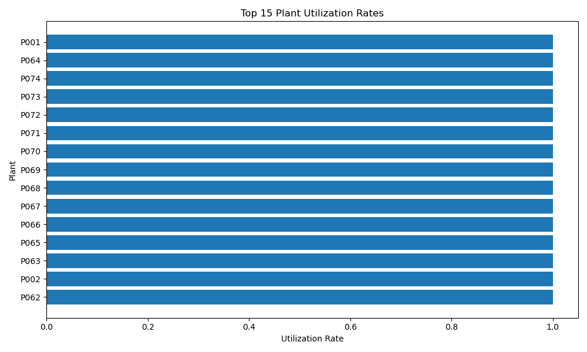
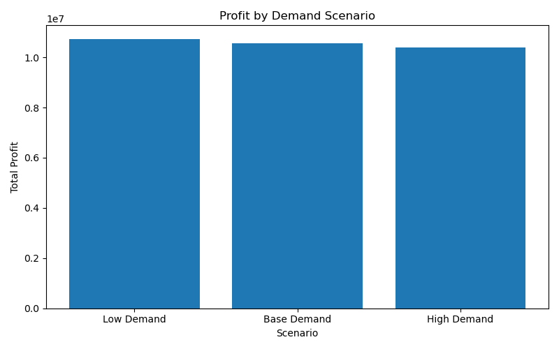

#  Supply Chain Decision Engine

An interactive supply chain optimization and analytics project designed to support data-driven operational decision-making through linear programming, scenario simulation, and visualization.

---

#  Project Overview

This project demonstrates how optimization and analytics can improve supply chain planning across a network of plants and markets.

The workflow includes:

- Data preprocessing
- Linear programming optimization
- Scenario simulation
- Data visualization
- Interactive dashboard development

The model determines the most profitable shipment strategy while considering operational constraints such as production capacity, transportation costs, and market demand.

---

#  Business Problem

Supply chain teams often struggle to evaluate:

- Demand fluctuations
- Transportation cost changes
- Inventory bottlenecks
- Profit tradeoffs
- Capacity allocation across plants and markets

This project helps visualize and optimize these scenarios interactively, enabling more informed operational and strategic decisions.

---

#  Key Features

- Linear programming optimization model  
- Shipment allocation optimization  
- Scenario-based simulation analysis  
- Supply chain network visualization  
- Interactive Streamlit dashboard  
- Operational KPI tracking  

---

#  Tech Stack

- Python
- Pandas
- Streamlit
- Plotly
- PuLP
- NetworkX
- Matplotlib

---

#  Visualizations

## Supply Chain Network Graph



---

## Top Shipment Lanes



---

## Plant Utilization



---

## Scenario Profit Comparison



---

#  Key Insights

- Identified high-volume shipment lanes across the network
- Visualized plant utilization and operational bottlenecks
- Compared profitability under different supply chain scenarios
- Enabled scenario-based operational planning and decision-making

---

#  Run the Project

## Step 1 — Preprocess Data

```bash
python src/preprocess.py
```

## Step 2 — Run Optimization Model

```bash
python src/optimization_model.py
```

## Step 3 — Run Scenario Simulation

```bash
python src/scenario_simulation.py
```

## Step 4 — Generate Visualizations

```bash
python src/visualize_results.py
python src/network_graph.py
```

## Step 5 — Launch Interactive Dashboard

```bash
streamlit run dashboard/app.py
```

---

#  Project Goal

The goal of this project is to demonstrate how analytics, optimization, and interactive visualization can support real-world supply chain decision-making and operational strategy.
